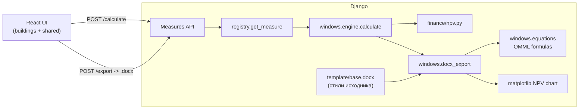

# Архитектура проекта

## Назначение

Энерго-аудит. Каждое отдельное мероприятие (окна, отопление, вентиляция и т.п.) — это самостоятельный модуль, у которого есть свои входные параметры, формулы расчёта и шаблон выгрузки в Word. Бэкенд предоставляет два API на каждое мероприятие: получить расчёт (JSON) и выгрузить раздел отчёта (`.docx`). Фронтенд — это интерактивный экран, на котором пользователь заполняет данные и видит результат.

## Структура каталогов

```text
energy saving calculator/
├── backend/                      # Django + DRF
│   ├── config/                   # settings, корневые urls
│   ├── measures/                 # каталог мероприятий
│   │   ├── apps.py               # AppConfig + регистрация мероприятий в ready()
│   │   ├── registry.py           # реестр: slug → MeasureDefinition
│   │   ├── urls.py               # /api/measures/, /<slug>/calculate/, /<slug>/export/
│   │   ├── views.py              # generic-вьюхи calculate / export
│   │   ├── finance/
│   │   │   └── npv.py            # NPV, IRR (бисекция), DPI, PBP, DPBP, ряд DCF
│   │   ├── docx_utils/
│   │   │   ├── builder.py        # таблицы/абзацы/подписи/формулы для .docx
│   │   │   ├── chart.py          # matplotlib (Agg) → PNG для NPV-графика
│   │   │   └── number_fmt.py     # «1 234,56», %, тенге, годы
│   │   └── windows/              # мероприятие «Окна» (см. docs/MEASURES/windows.md)
│   │       ├── __init__.py       # register_measure(...)
│   │       ├── presets.py        # пресеты по типам зданий
│   │       ├── serializers.py    # контракт API
│   │       ├── engine.py         # формулы Q_т, Q_inf, итоги, экономика
│   │       ├── equations.py      # OMML-формулы для Word (Cambria Math)
│   │       ├── docx_export.py    # сборка раздела отчёта
│   │       └── template/
│   │           └── base.docx     # «голая» база шаблона: стили/тема/шрифты исходника
│   ├── scripts/
│   │   └── strip_base.py         # одноразовый: пересобирает template/base.docx из исходника
│   ├── manage.py
│   └── requirements.txt
├── frontend/                     # React (Vite)
│   ├── src/
│   │   ├── App.tsx               # корневой экран (сейчас открывает мероприятие «Окна»)
│   │   ├── App.css               # стили UI
│   │   ├── main.tsx              # точка входа React
│   │   └── measures/windows/     # компоненты мероприятия «Окна»
│   │       ├── BuildingsList.tsx
│   │       ├── SharedParamsForm.tsx
│   │       ├── InvestmentTable.tsx
│   │       ├── ResultsPanel.tsx
│   │       ├── WindowsMeasure.tsx
│   │       ├── defaults.ts
│   │       ├── format.ts
│   │       └── types.ts
│   └── vite.config.ts            # dev-сервер + proxy /api → Django
└── docs/
    ├── ARCHITECTURE.md
    ├── API.md
    └── MEASURES/
        └── windows.md
```

## Поток данных



1. Пользователь заполняет форму → клик «Рассчитать» → `POST /api/measures/windows/calculate/` → JSON с расчётом.
2. Клик «Скачать .docx» → `POST /api/measures/windows/export/` → ответ `application/vnd.openxmlformats-officedocument.wordprocessingml.document` сохраняется в файл через `Blob`.

## Плагин-система мероприятий

Каждое мероприятие — пакет внутри `measures/`, который при импорте регистрирует себя:

```python
register_measure(MeasureDefinition(
    slug="windows",
    title="Улучшение теплозащитных свойств оконных блоков",
    input_serializer_cls=WindowsInputSerializer,
    calculate=calculate,
    build_docx=build_docx,
    docx_filename="windows_thermal_insulation.docx",
))
```

Контракт:

- `input_serializer_cls` — DRF-сериализатор для валидации тела запроса.
- `calculate(payload) -> dict` — чистая функция (без HTTP/ORM), считает все показатели.
- `build_docx(payload, results) -> bytes` — собирает `.docx` (через `python-docx` и `matplotlib`).

Чтобы добавить новое мероприятие, достаточно создать пакет `measures/<name>/`, реализовать эти три точки и зарегистрировать в `measures/apps.py` (или импортом из `__init__.py` пакета).

## Где что менять

| Задача | Место |
|--------|--------|
| Изменить формулу расчёта «Окон» | `backend/measures/windows/engine.py` |
| Поменять/добавить поля API | `backend/measures/windows/serializers.py` + `frontend/src/measures/windows/types.ts` + `docs/API.md` |
| Изменить разметку Word-выгрузки | `backend/measures/windows/docx_export.py` (+ хелперы в `docx_utils/`) |
| Поменять Word-формулы | `backend/measures/windows/equations.py` (OMML DSL и сборщики `eq_*`) |
| Заменить шрифты/стили шаблона | пересобрать `backend/measures/windows/template/base.docx` через `scripts/strip_base.py` |
| Финансовая модель (NPV/IRR/PBP/DPBP) | `backend/measures/finance/npv.py` |
| Стили/UX | `frontend/src/App.css`, компоненты в `frontend/src/measures/windows/` |
| CORS / продакшен | `backend/config/settings.py` |
| Прокси dev-сервера | `frontend/vite.config.ts` (`server.proxy`) |

## Зависимости между слоями

- `engine.py` и `finance/npv.py` не знают про Django — их легко покрыть юнит-тестами.
- `serializers.py` задаёт контракт API; при изменении полей синхронизируйте `types.ts` и `docs/API.md`.
- `views.py` — только склейка валидации, вызова движка и сериализации ответа.
- `docx_export.py` опирается на форму результата `calculate(...)`. Если расширили движок, не забудьте обновить и `.docx`-сборку.
